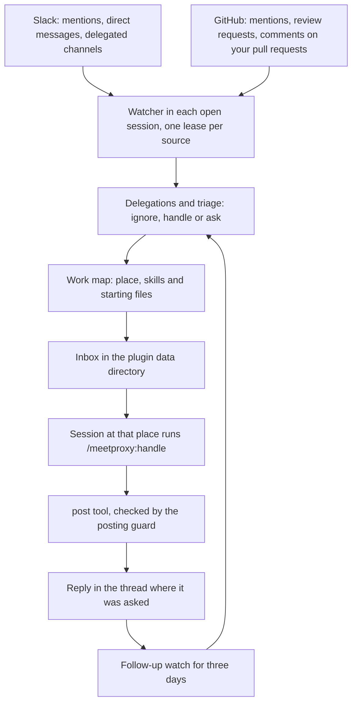

<div align="center">
  <h1>meetproxy</h1>
</div>

<div align="center">
  <h3>meetproxy, not meatproxy.</h3>
  <p>Stop being a meat proxy.</p>
</div>

<div align="center">
  <a href="https://github.com/jeon-jihyeon/meetproxy/releases"></a>
  <a href="https://github.com/jeon-jihyeon/meetproxy/actions/workflows/test.yml"></a>
  
  
</div>

<br>

> **The first 30 seconds:** install the plugin, and the next session you open fetches a checksum verified binary and starts learning where you work from your own transcripts in the background.
> About 15 seconds later it checks Slack and GitHub for messages that mention you, then once a minute. Nothing is posted yet.
> When a teammate asks you something, the request gets :eyes:, a session working in the right place answers it in the thread with a line saying Claude wrote it, and you are asked first whenever it needs your decision.

meetproxy is a Claude Code plugin that carries requests between people and your AI session so you don't have to. A teammate asks in Slack or on GitHub, meetproxy brings the request into the session already working where the answer lives, and the refined answer goes back where it was asked, written the way you write. Every answer leaves a note of the code it came from, so the next similar request starts in the right place.

## Why meetproxy?

A meat proxy is a person who sits between a coworker and an AI and only carries text: the question goes in by copy paste, the answer comes out the same way, unread.

- **The word** — `meat` is old hacker slang for the human attached to a machine, as in [meatware](http://catb.org/jargon/html/M/meatware.html), and a `proxy` forwards traffic without changing it
- **The meme** — The earliest AI use we found is [Meat-based LLM proxies](https://not-an-llm.com/meat-based-llm-proxies) in March 2026. It spread with Niklas Gruhn's [Don't be a meat proxy](https://gruhn.me/blog/2026-08-03/) and its [Hacker News thread](https://news.ycombinator.com/item?id=49151933) in August 2026
- **The cost** — Generating an answer got cheap but checking it did not, so the reader [pays for the verification](https://agentpatterns.ai/patterns/anti-patterns/meat-proxy/) the carrier skipped

meetproxy was built to remove that role. The carrying is automated, the judgment a relay should add still happens in your session, and every post says it was written by Claude. The requester meets the answer directly. That is the `meet` in the name.

## Quickstart

```
/plugin marketplace add jeon-jihyeon/meetproxy
/plugin install meetproxy@meetproxy
```

That is all for GitHub once `gh` is logged in. For Slack, install the Slack plugin and optionally set up a personal token, both covered under [Requirements](#requirements).

```
/plugin install slack@claude-plugins-official
/reload-plugins
/meetproxy:slack setup
```

The binary is fetched from the matching GitHub release on first run, and no API key is needed because the work happens in your own Claude Code sessions. `/meetproxy:status` shows what is connected and the fix for anything that is not.

## Requirements

| Need | Why | Check |
|---|---|---|
| Claude Code 2.1.287 or later | the [mod API](https://code.claude.com/docs/en/plugins/mods/api) the watcher runs on | `claude --version` |
| macOS or Linux on amd64 or arm64 | the platforms releases are built for | `uname -sm` |
| `curl`, `tar` and `sha256sum` or `shasum` | the launcher downloads the release and checks it against `checksums.txt`. With Go installed it falls back to `go install` | `command -v curl tar shasum` |
| `gh` logged in | GitHub mentions, review requests, comments on your pull requests, and posting there. The default scopes of `gh auth login`, `repo` and `read:org`, cover it, since `repo` reads notifications and writes comments | `gh auth status` |
| The official Slack plugin `slack@claude-plugins-official` | a session reads the Slack thread through it while it answers, and without a token the minute check reads mentions through it too | `/mcp` lists the Slack server |
| A personal Slack token, optional | see below | `/meetproxy:slack` |

A personal Slack token is a user token of a small Slack app you create from the manifest `/meetproxy:slack setup` fills in. It stays in the plugin data directory with mode 0600, readable by you alone, and goes only to `slack.com`. With it the binary reads and posts Slack itself, which unlocks:

- **No busy session** — the minute check makes no connector call, so terminal multiplexers such as cmux stop showing the session as running every minute
- **Direct messages** — the connector cannot list them, so the `dm` delegation reads them with a token only
- **Follow-ups in Slack threads** — replies after a meetproxy post come back as the same request
- **Shared channel detection** — a channel shared with another organization is told apart, so its requests ask you first instead of being answered alone
- **Retract by edit or delete** — `/meetproxy:status retract <n>` edits or deletes the reply, where the connector can only post a correction under it

The app asks for these user scopes: `search:read`, `channels:history`, `groups:history`, `im:history`, `mpim:history`, `users:read`, `chat:write`, `reactions:write`, `channels:read`, `groups:read`, `im:read` and `mpim:read`. A scope it lacks turns off only what needs it, and `/meetproxy:slack` names it.

## How it works



From the moment a session opens, meetproxy checks every connected source each minute for messages that mention you. One session holds the lease of each source and reads it, and another takes over within three minutes when it closes.

| Source | Receives | Sends | Connected by |
|---|---|---|---|
| Slack | mentions, direct messages with a token, and every message of a channel you delegate | a reply in the thread | a personal token set up with `/meetproxy:slack setup`, or the [Slack plugin](https://github.com/anthropics/claude-plugins-official) |
| GitHub | mentions in comments, review requests, and comments of others on your own pull requests | a comment, or a reply in the review thread | a logged in `gh` |

Adding a service touches one entry in the source table of [internal/dest](internal/dest/dest.go), one case in each of the dispatchers of the [watcher](plugin/hooks/meetproxy.js) (`owner`, `ready`, `receive`, `covered`, `send`, `replies`, `react` and `unsay`), the tool dispatch of the [posting guard](internal/guard/guard.go) and a reference for the [relay skill](plugin/skills/relay/references). Triage sorts each message.

- **ignore** — not a request. Only its link, sender and reason are kept, for three days
- **handle** — answered where it was asked, at the place on your machine the work map picks, with the skills and starting files you used for similar requests. A session working in that place takes it, otherwise the session reading that source works there by absolute paths. A request need not concern a repository
- **ask** — needs you, such as a deploy approval or a decision. The session stops to ask whether to answer it now, later or not at all, and posts nothing before you choose

A request you wrote yourself is handled without triage. Replies go only where the request came from. A request that is queued gets an :eyes: reaction and one that was answered a :white_check_mark:, or eyes and hooray on GitHub. A reply that already ends with the meetproxy mark, yours or a teammate's, means the request is covered.

Every post is kept in a ledger for 30 days and its thread is read for three days. A reply there comes back as the same request through triage, and one that says the answer was wrong lowers how much that answer counts in the location map and asks you. A question meetproxy asked back waits for the requester and asks you after three days without an answer. `/meetproxy:status retract <n>` corrects or removes a reply it posted.

When a source stops working an idle session asks you once a day with the exact fix, and you can stop reading that source. When several requests need you they come as one question, a busy session leaves a request to an idle session of the same place, and a request you put off comes back at the time you chose. `/meetproxy:relay <link>` still hands over one request by hand, and a request waiting for the place a new session starts in is named when it opens.

Triage uses the session's own Claude by default. `/meetproxy:triage codex` switches to Codex, and `/meetproxy:triage command <cmd>` plugs in any command that reads the message as JSON and prints a verdict. `/meetproxy:pause` stops all of it at once and `/meetproxy:pause resume` starts it again.

A person in the middle makes three calls before pasting anything. meetproxy makes them in the session instead.

- **Ask back** — When a request is missing what it takes to start, it asks the requester, never you
- **Point to where to look** — It picks the place on your machine from the work map and hands over the files that answered similar requests as starting points
- **Refine for the reader** — It writes the conclusion first with one piece of evidence the reader can check, follows your own rules and recent examples for that kind of output, and marks the post as written by Claude

### Delegate

Pull requests that come with a mention are reviewed with no setup, and approval stays with requests you made yourself. A review someone requests on GitHub asks you first. For anything else, say what to take over.

```
/meetproxy:delegate when Datadog posts a Triggered alert in #devops-emergency, investigate it and reply in the thread
/meetproxy:delegate when a message in #ops mentions me, run incident-triage on it but ask me first
```

meetproxy turns the sentence into a delegation with when, do and post parts, then checks what that delegation needs before saving it: the sources it reads, a GitHub login for reviews, the tools an investigation can use. It gives the exact command for what only you can do, such as a login.

| Part | Choices |
|---|---|
| When | mentions of you in any source, review requests, direct messages, comments on your own pull requests, or every message of a Slack channel, narrowed by author id or exact display name, words or a pull request link |
| Do | `answer`, `review` a pull request, `investigate` an alert, or any skill you have |
| Post | on its own, or after asking you. Reviews comment unless the delegation lets them approve |

`/meetproxy:delegate` lists what is delegated and `/meetproxy:delegate remove <id>` takes one back. Five built in delegations come after yours: mentions with a pull request link are reviewed, requested reviews ask you first, direct messages and other mentions are answered after triage, and comments on your own pull requests ask you first.

## Commands

| Command | Arguments | What it does |
|---|---|---|
| `/meetproxy:status` | `[retract <n>]` | Shows every source, the Slack token, the inbox, posted replies, ignored messages, open relays, hook failures and kept state, with the fix for each problem. `retract <n>` corrects or deletes reply n of that list |
| `/meetproxy:delegate` | `[what to take over \| remove <id>]` | Turns a sentence into a delegation, checks what it needs and saves it after you confirm. No argument lists the delegations |
| `/meetproxy:slack` | `[setup]` | Checks the Slack token, or with `setup` walks you through creating the app and storing the token |
| `/meetproxy:triage` | `[claude \| codex \| command <command line>]` | Shows or chooses what sorts messages into ignore, handle and ask |
| `/meetproxy:allow` | `[github:owner/* \| github:owner/repo \| slack:CHANNEL \| link]` | Allows a destination besides where a request came from. No argument lists the patterns |
| `/meetproxy:pause` | `[resume]` | Stops queuing and taking requests in every session, or starts again |
| `/meetproxy:map` | `[show]` | Refreshes the work map now, or shows its places, skills and output formats |
| `/meetproxy:relay` | `<Slack or GitHub link>` | Hands over one request by hand and posts the refined answer where it was asked |
| `/meetproxy:review` | `<pull request link \| Slack link> [--approve]` | Reviews a pull request, comments on GitHub and replies with a verdict where it was asked. Approves only with `--approve` |
| `/meetproxy:investigate` | `<Slack link>` | Investigates an alert with read-only tools and replies with a verdict, the first action and the evidence |
| `/meetproxy:handle` | `<request id> [--auto \| --ask]` | Internal. The watcher runs it to take one queued request, with `--auto` when it may finish alone and `--ask` when it needs you |

## What's inside

- **[relay skill](plugin/skills/relay/SKILL.md)** — The flow from a request link to a posted answer
- **[Watcher](plugin/hooks/meetproxy.js)** — A Claude Code mod that receives from each connected source by the delegations, runs triage, starts the handle skill in a session working at the place the work map picks, and sends replies through its `post` tool
- **[handle skill](plugin/skills/handle/SKILL.md)** — Takes one queued request by id so only one session answers it, opens the relay, then follows the skill its delegation names. Started by the watcher, it posts nothing that needs your decision, and a request it leaves unsettled comes back to ask you
- **[delegate](plugin/skills/delegate/SKILL.md)**, **[triage](plugin/skills/triage/SKILL.md)**, **[allow](plugin/skills/allow/SKILL.md)**, **[pause](plugin/skills/pause/SKILL.md)**, **[map](plugin/skills/map/SKILL.md)**, **[slack](plugin/skills/slack/SKILL.md)** and **[status](plugin/skills/status/SKILL.md)** skills — The settings and checks in the table above
- **[review skill](plugin/skills/review/SKILL.md)** and **[investigate skill](plugin/skills/investigate/SKILL.md)** — The tasks a delegation can name besides answering, also runnable by hand with a link
- **Posting guard** — A PreToolUse hook on Bash, every MCP tool, Write, Edit and NotebookEdit, described under [Safe by default](#safe-by-default)
- **Work map** — Built from your own Claude Code transcripts the first time a session starts, then refreshed once a day by the first session of the day in a separate process that never touches a session. Run `/meetproxy:map` to refresh it at once. It knows the places you work in, the skills and commands you have, and which place, skills and files answered each request you typed. A request is matched in layers: a place it names, then past requests that agree, then a model picks among a few candidates. It also learns how you write each kind of output, such as commits, pull requests, review replies, Linear issues and Slack messages: the sections of your CLAUDE.md, rules and memory files whose heading names that kind, by file and line only, and your three newest outputs of each kind that went through, kept on your machine. A session runs `meetproxy map format <kind>` before it writes one
- **Location map** — A PostToolUse hook that records the paths read while handling a request, in a repository or in the session directory, and `meetproxy locate` to find them for the next one
- **[Launcher](plugin/bin/meetproxy)** — Runs the binary for the plugin version from a cache, a checksum verified release, or `go install`

## Safe by default

Request text is untrusted, since anyone who can mention you writes it. The skills that handle a request get narrow allowed tools, which is the main defense. The posting guard is defense in depth around them.

- **Where posts may go** — While a session handles a request, from the take until the turn that settled it ends, posts may go only to where the request came from, the pull request or issue the task works on, and the [allow list](plugin/skills/allow/SKILL.md). The `post` tool makes the same check before it sends, and a check that fails or times out denies the post
- **What is left to you** — Merging, closing, deleting, approving a pull request without a delegation that allows it, and changing meetproxy settings such as delegations, triage, the allow list or pause. Editing the plugin data directory with a file tool or a shell redirection is denied too
- **Who may steer it** — A request from outside your Slack workspace or GitHub organization asks you first whatever triage said. Guests and restricted Slack accounts never count as your team, a channel shared with another organization counts as outside, and a delegation posts alone only for author ids it names, never display names. A request found more than an hour late asks you too
- **What it parses** — Every repository a `gh` write names must pass, including commands chained, wrapped, run through `bash -c`, `eval` or `xargs`, or hidden in substitutions. A `gh` write to a host other than github.com and a `gh` command it cannot judge are denied. An allow pattern that covers a whole source such as `slack:*` is refused
- **Fails closed** — An MCP tool that may write somewhere the guard cannot tell is denied, a guard that errors denies, and without a binary the launcher blocks the tool call while a session handles a request. Commands that do not post are never blocked, and outside a request the guard steps aside so your own sessions work as usual
- **Honest posts** — Every post ends with `_Written by Claude on behalf of the user_`, because hidden AI use costs more trust than disclosed use

Known limits of the guard, by design or not yet covered:

- It does not parse scripts run by path, copied `gh` binaries, raw IP hosts or WebFetch, and it denies inline interpreters such as `python -c` it cannot read
- A data directory path reached through `cd` or written relative is not seen
- It acts only while a session handles a request. A post you ask for in your own session is yours

## Data and privacy

### What is read

- Your Claude Code transcripts under `~/.claude/projects`, your CLAUDE.md, rules and memory files, and the skills and commands you have, to build the work map
- Slack messages that mention you, direct messages with a token, every message of a channel you delegate, and the threads meetproxy posted in
- GitHub notifications you participate in, the pull requests and issues they point at, and comments on your own pull requests
- The files a session reads while it handles a request, by path only

### What is kept

Everything lives in `${CLAUDE_PLUGIN_DATA}`, which is `~/.claude/plugins/data/meetproxy-meetproxy` for an install from this marketplace. Directories are 0700 and files 0600. `meetproxy tidy` runs once a day from session start and removes what the table says.

| Path | Holds | Kept |
|---|---|---|
| `inbox/<id>.json` | one request: link, sender id, keywords, place, status. Not the message text | waiting, asked and question requests close after 14 days, held ones after 30, and closed ones are removed 7 days later |
| `inbox/ignored.jsonl` | messages read and not queued: link, sender, delegation and reason, never the text | 3 days |
| `inbox/corrupt/` | request files that could not be read, moved aside | until you remove them |
| `inbox/cursor*`, `inbox/lease-*.json`, `inbox/paused`, `inbox/lock` | where each read left off, which session reads each source, the pause switch | replaced in place, a lease lasts 3 minutes |
| `posts/posts.jsonl` | every reply meetproxy posted: its link, the request link, up to 4000 characters of the body, kind and mode | 30 days |
| `posts/watch/` | threads read for follow-ups and the newest reply already seen | 3 days after the last post in the thread |
| `relay/open/`, `relay/ended/` | the request each session handles | closed after 7 days when the session ended, ended records 1 hour |
| `relay/observed/` | paths read while a request was handled | 30 days, longer while its relay is still open |
| `relay/closed.jsonl` | each answered request: topic, keywords and evidence paths | 90 days |
| `map.jsonl` | location map: topic, keywords, paths and weight | compacted past 256 KB to the last record of each request, dropping files that are gone |
| `workmap/` | `places.json`, `methods.json` with skill names and descriptions, `cases.jsonl` with the requests you typed and the place, skills and files that answered them, `formats.json` with guide locations and up to three examples of 1500 characters per output kind, `state.json` | rebuilt daily. Cases newer than 180 days or the newest 5000 |
| `delegations.json`, `dest.json`, `triage.json` | your delegations, allow list and triage engine | until you change them |
| `slack/token` | the personal Slack token, mode 0600 | until you remove it |
| `slack/auth.json`, `slack/users.json`, `slack/setup.json` | who the token acts for, users looked up, your answer to the token question | users for 24 hours, the rest until replaced |
| `health.json` | the last check of each source and the last 10 hook failures | replaced in place |
| `scope/`, `tidy.json`, `*.lock` | which sessions handle a request now, when tidy last ran, locks | while they are needed |

Outside the data directory:

- `~/.meetproxy/bin/v<version>/meetproxy` holds the downloaded binary of each version
- The watcher's mod store, which Claude Code keeps in `~/.claude/plugins/store/meetproxy_meetproxy-*.json`, holds small keys: `session:<id>` and `activity:<id>` for open sessions, `slackUser`, `slackEmail`, `slackTeam` and `githubUser` for who you are, `slackTrust:<user>` and `slackShared:<channel>` cached for 24 hours, `ghseen:<notification>` for a day, `slackSetupAsked`, and `nag:<source>` and `muted:<source>` for source problems

### What leaves your machine

- Posts, edits and deletions of meetproxy's own replies, and reactions on request links, sent to Slack or GitHub
- Reads from the Slack API with your token or through the Slack connector, and from the GitHub API through `gh`
- Message text given to the triage engine you chose: the session's own Claude through Claude Code by default, Codex, or your command
- The launcher downloads the release from GitHub

There is no meetproxy server and no telemetry.

### How to wipe it

Close every session first, then remove the data directory, the binaries and the mod store.

```sh
rm -rf ~/.claude/plugins/data/meetproxy-meetproxy ~/.meetproxy
rm -f ~/.claude/plugins/store/meetproxy_meetproxy-*.json
```

With a Slack token, also remove the Slack app you created from your workspace's app settings, which revokes the token. With `CLAUDE_CONFIG_DIR` set, use it in place of `~/.claude`.

## Uninstall

```
/plugin uninstall meetproxy@meetproxy
/plugin marketplace remove meetproxy
```

```sh
rm -rf ~/.claude/plugins/data/meetproxy-meetproxy ~/.meetproxy
rm -f ~/.claude/plugins/store/meetproxy_meetproxy-*.json
```

## Troubleshooting

### The session shows as busy every minute in a terminal multiplexer such as cmux

Without a Slack token the session holding the Slack lease reads Slack through the connector each minute. Each connector call fires the PreToolUse hooks, so the multiplexer shows the session as running. Run `/meetproxy:slack setup` to read Slack with a token instead, and no tool call runs in any session.

### The guard denied a post

The message starts with `meetproxy: a request is being handled` and names why.

- A destination outside the request, its target and the allow list: the session prints the answer instead. Post it yourself, or run `/meetproxy:allow <destination>` in a session that handles no request and ask again
- A merge, close, delete, approval or settings change: these are left to you on purpose
- `meetproxy: posting check failed`: the guard itself errored and failed closed. `/meetproxy:status` shows the newest hook failure

### The binary did not download

The launcher looks for a dev build, then `~/.meetproxy/bin/v<version>/meetproxy`, then the GitHub release checked against `checksums.txt`, then `go install`, then another `meetproxy` on `PATH`. It prints what failed to stderr.

- No `curl`, or no `sha256sum` and no `shasum`: install them, or install Go so it builds the same version
- `checksum ... does not match checksums.txt, refusing to run it`: the download was altered or cut off. Run the command again, and report it if it repeats
- Offline or behind a proxy: download `meetproxy_<os>_<arch>.tar.gz` from the release yourself, [verify it](#verifying-releases), and extract `meetproxy` into `~/.meetproxy/bin/v<version>/`

### meetproxy was updated, run /reload-plugins in this session

The binary and the watcher speak a numbered protocol, and a session still running an older watcher stops instead of misreading a newer binary. Run `/reload-plugins` in that session, or restart it.

### Corrupt files

A request file that cannot be read is moved to `inbox/corrupt/<name>.<unix seconds>` so one broken file never stops every session, and `/meetproxy:status` counts them. Look at them if you like, then delete them. `health.json` starts over when it cannot be read, and the ledger, the ignored list and the location map drop lines that do not parse when they are pruned.

### Nothing arrives

Run `/meetproxy:status`. A source with an error names its fix, `/meetproxy:delegate` checks what a source needs, and `/meetproxy:pause resume` undoes a pause. At least one session has to be open, since the watcher runs inside sessions.

## Verifying releases

From 0.1.8 on, each release carries a build provenance attestation for its archives and `checksums.txt`, made by the release workflow of this repository.

```sh
gh release download v0.1.8 -R jeon-jihyeon/meetproxy -p 'meetproxy_darwin_arm64.tar.gz' -p checksums.txt
gh attestation verify meetproxy_darwin_arm64.tar.gz -R jeon-jihyeon/meetproxy
gh attestation verify checksums.txt -R jeon-jihyeon/meetproxy
```

The launcher checks every download against `checksums.txt` on its own, so the attestation is for when you want to know the release was built from this repository.

---

## Resources

- [Changelog](CHANGELOG.md) — what changed in each version
- [Contributing](.github/CONTRIBUTING.md) and [security policy](.github/SECURITY.md)
- [Claude Code plugins](https://code.claude.com/docs/en/plugins) — how plugins, skills and hooks are installed and loaded
- [Claude Code hooks](https://code.claude.com/docs/en/hooks) — the PreToolUse, PostToolUse, SessionStart and Stop events the guard, the location map, the waiting notice, tidy and the work map refresh use
- [Claude Code mods](https://code.claude.com/docs/en/plugins/mods/api) — the timers, MCP calls and commands the watcher uses, Claude Code 2.1.287 or later
- [Releases](https://github.com/jeon-jihyeon/meetproxy/releases) — binaries for darwin and linux on amd64 and arm64
- [License](LICENSE) — MIT
